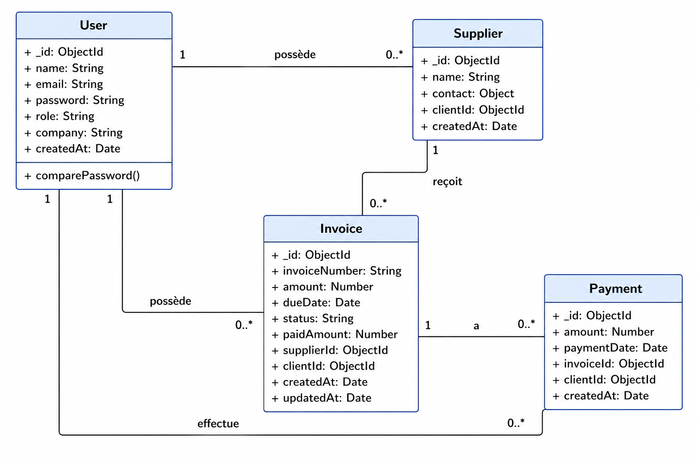
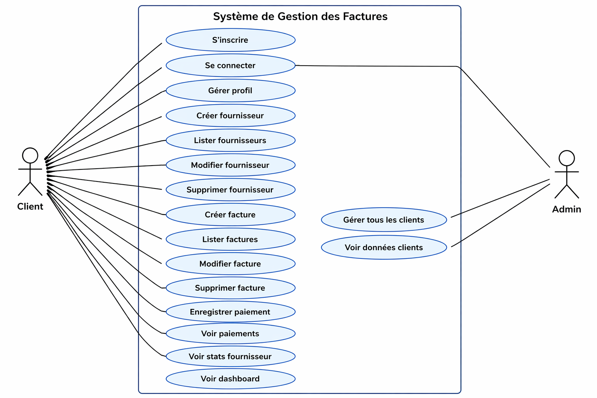

# Gestion Factures API

API backend sécurisée pour la gestion des fournisseurs, factures et paiements.  
Conçue pour entreprises et freelances afin de suivre les dépenses, les statuts des factures et les relations fournisseurs.

---

## Aperçu

Cette API permet de :
- Gérer les fournisseurs
- Créer et suivre les factures
- Enregistrer des paiements partiels ou complets
- Calculer automatiquement le statut des factures
- Analyser les dépenses par fournisseur
- Fournir un dashboard global

Contexte complet : :contentReference[oaicite:0]{index=0}

---

## Stack Technique

- Node.js
- Express.js
- MongoDB + Mongoose
- JWT (authentification)
- bcrypt (hash password)

---

## Architecture

config/
controllers/
middleware/
models/
routes/
server.js

## Authentification (JWT)

Toutes les routes protégées nécessitent :

Authorization: Bearer <token>

### Routes

- `POST /api/auth/register`
- `POST /api/auth/login`
- `GET /api/auth/me`

---

## Fournisseurs (Suppliers)

- `POST /api/suppliers`
- `GET /api/suppliers`
- `GET /api/suppliers/:id`
- `PUT /api/suppliers/:id`
- `DELETE /api/suppliers/:id`

---

## Factures (Invoices)

- `POST /api/invoices`
- `GET /api/invoices`
- `GET /api/invoices/:id`
- `PUT /api/invoices/:id`
- `DELETE /api/invoices/:id`

---

## Paiements (Payments)

- `POST /api/invoices/:id/payments`
- `GET /api/invoices/:id/payments`

---

## Statistiques

- `GET /api/suppliers/:id/stats`
- `GET /api/dashboard`

---

## Admin Routes

- `GET /api/admin/clients`
- `GET /api/admin/clients/:id/suppliers`
- `GET /api/admin/clients/:id/invoices`
- `GET /api/admin/clients/:id/payments`

---

## Logique Métier

Statut facture :
- `unpaid`
- `partially_paid`
- `paid`

Contraintes :
- Un client voit uniquement ses données
- Une facture appartient à un fournisseur
- Paiements partiels autorisés
- Suppression facture impossible si paiements existants

---

## Diagrammes UML

### Diagramme de Classes

### Diagramme de Cas d’Utilisation

---

